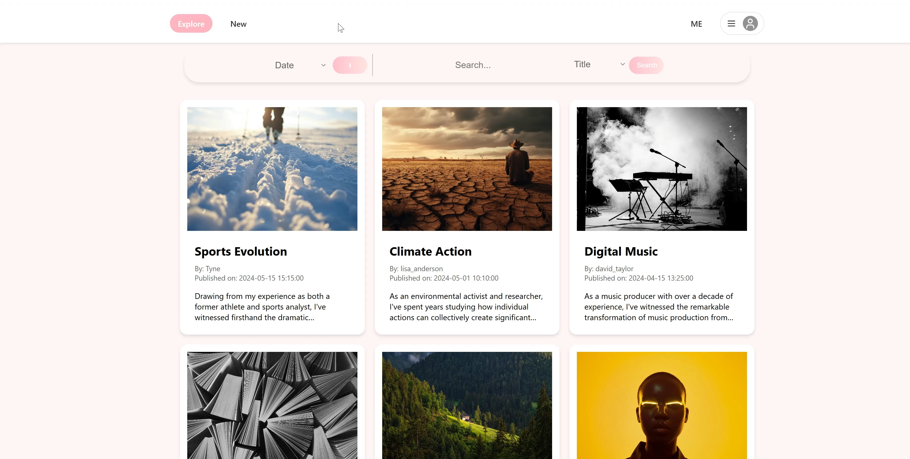
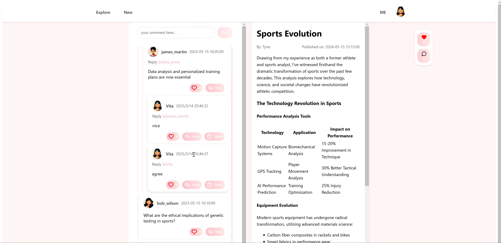
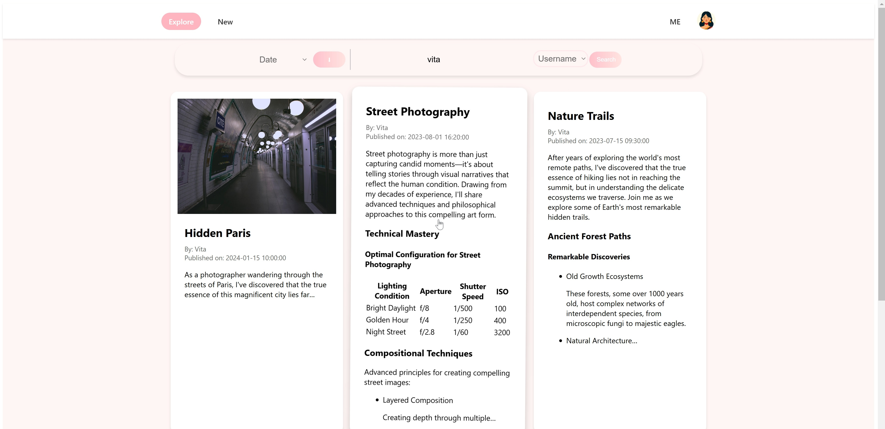

## Technical Overview
<!-- Project Badges -->


- This project is a **full-stack personal blogging platform** built with a **SvelteKit frontend** and an **Express.js backend**.  
It adopts a clear separation of concerns:

### Screenshots
<p align="center">
  <p>Homepage</p>
  <p>Comments</p>
  <p>Search&Order</p>
</p>

### **Frontend** (`/frontend`)
- Built with **SvelteKit**
- Interactive user interface
- Rich text editing via **TinyMCE**
- Date selection via **Flatpickr**
- Responsive design

### **Backend** (`/backend`)
- Developed with **Express.js**
- **SQLite** for persistent storage
- Authentication with **JWT**
- Password hashing via **bcrypt**
- Image uploads via **Multer**
- Schema validation with **Yup**

### **Java Client** (`/java-client`)
- Desktop **Swing** application for administrative management of accounts and content

---

## Features

- User registration & login with secure authentication  
- Role-based access control (**normal user / admin / super admin**)  
- Article publishing & editing with WYSIWYG editor  
- Commenting system  
- Image upload & storage  
- Admin panel with management capabilities  

---

## Preloaded Accounts for Testing

### **Users**
- `Vita / loveuvita`
- `Tyne / loveutyne`

### **Admins**
- `admin / admin` (**super admin**, undeletable)
- `admin1 / admin1`
- `admin2 / admin2`

## Getting Started

Follow the steps below to set up the project locally for development.

### 1. Clone the Repository
```bash
git clone https://github.com/leonalu12/BlogWebsite.git
cd BlogWebsite
```

### 2. Backend Setup (/backend)
```bash
cd backend
npm install
```
Create a .env file in the backend directory and configure the environment variables:
```env
PUBLIC_API_BASE_URL=http://localhost:3000/api
PUBLIC_IMAGES_URL=http://localhost:3000/images
```
Run the backend in development mode:

```bash

npm run dev
```
By default, the backend runs at http://localhost:3000.

### 3. Frontend Setup (/frontend)
```bash

cd ../frontend
npm install
```
Start the frontend development server:

```bash

npm run dev
```
The frontend will run on http://localhost:5173 and will communicate with the backend using PUBLIC_API_BASE_URL.

### 4. Java Client Setup (/java-client)
Open the /java-client directory in IntelliJ IDEA or any Java 17+ compatible IDE.

Configure database or API connection settings if required.

Run the main class (e.g., Main or App) to start the Swing admin console.

### 5. Code Formatting
Backend

```bash

cd backend
npm run format
```
Frontend

```bash

cd frontend
npm run format
```


## a. Team name

Keeping Up With the Karshions

## b. Are there any special setup instructions, beyond initialising the database and running your project?

We have no special setup instructions.:D

## c. At least one username / password combination for an existing user in your system with some already-published articles & comments

-username: Vita -password: loveuvita

-username: Tyne -password: loveutyne

## d. Any other instructions / comments you wish to make to your markers
In Java Swing, we have set up a separate database for administrators. We have one super admin and two regular admins. The super admin account cannot be deleted, while the other admin accounts can be deleted.

Super admin:

-username: admin - password: admin

Other admins:

-username: admin1 - password: admin1

-username: admin2 - password: admin2


# Final project - A personal blogging system - Team $GROUPNAME

This repository contains a starting point for your team's final project. We look forward to seeing your progress and your final results this semester!

Your team should update this README to include the information required, as presented in the project handout available on Canvas.

Your team members are:
$TEAMMEMBERS

## Development Environment Setup & Commit Guidelines

It is important each team member has the right development environment setup on their computer.
Please update this with any other processes your group is following.

Extensions to install:

- [VSCode Prettier](https://marketplace.visualstudio.com/items?itemName=esbenp.prettier-vscode)
- [VSCode Svelete](https://marketplace.visualstudio.com/items?itemName=svelte.svelte-vscode)
- _Add other optional extensions here :)_

Commands to run before commits:

- In Backend `npm run format` to double check code is formatted
- In Frontend `npm run format` to double check code is formatted

All commits MUST have a brief descriptive message

## Git

> [!IMPORTANT]
> It is always easier to merge files that are either new files, or files that no one else has changed. Create new modules / components to reduce the chance of Git Conflicts! However expect conflicts to occur as part of normal development.

> [!TIP]
> The below assumes you have experience with GIT Pull requests, if not please address this.

All groups MUST use Pull Requests (PR) with at least 1 peer review for merging code into main, this is to improve code quality and to give team members an opportunity to understand your code in case they need to use it.

If team-members don't need to use PR, then they should be working on feature branches and get latest commits in main by merging main into their feature branch (`git merge main`, or `git rebase main`).

> [!TIP]
> Consider a branch naming convention `feature/<some-meaningful-feature-name>`

Correct and **timely** execution of the PR process with evidence of good code review can contribute **significantly** to a better codebase and team member collaboration.

$IMAGE
